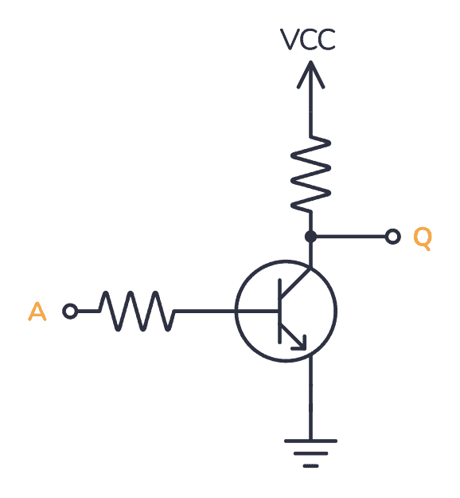

# Lama Processing Unit

## Chapter 0:Introduction

### 0.1:Backgrond

At 20 years old, I've been casually programming for 4 years and professionally for 1. One day, while watching a video about CPUs, I realized I knew absolutely nothing about how anything works—from how the computer actually operates to how my "magic words" make magic things happen on the screen. My curiosity couldn’t stand the basic notion I had of how my code came together, so I had an idea: Why not build everything from scratch? Maybe that way, I’ll understand at least something.

Clearly, becoming a true master at something is a long-lasting mission (usually good old death will catch up with you before you’re fully satisfied) so my computer will be a lot simpler than the LLM-creating machines of today. Still, I feel like it will be a long but fun journey into exploring this beautiful world.

### 0.2 Aim of LPU:

As mentioned earlier, building a real modern CPU is way out of scope for this project, so here are the goals I will strive for:

- Understand the basics of electronics and how logic gates actually work.
- Gradually understand more and more complex circuits.
- Design a functional CPU from scratch.
- Create a simulation of the CPU.

Right now, building a physical copy of this CPU is not a goal, but we’ll see how burnt out I get from this specific project.

### 0.3: Lama?

Here are the absolutely compelling reasons behind the name of this particular CPU built from scratch:

## Chapter 1: Electronics

### 1.1: How can I not know this stuff?

Even the people closest to me would probably be surprised by how many basic things I actually don’t know. Electronics is definitely one of those areas. While it’s not strictly necessary for coders, I still feel kind of ashamed of my lack of understanding, even of the most basic concepts. Since we’re here for that reason, I’ll start from the beginning and continue until I feel the depth of my knowledge is sufficient for this project.

### 1.2: How Electricity Works

_Everything_ is made of atoms, and atoms are made of three components:

- Protons (positively charged)
- Neutrons (neutral charge)
- Electrons (negatively charged)

Protons and Neutrons are clamped together in the nucleus, while the electrons are free to flow around them (attracted by the protons since they have opposite charges).

In some materials, electrons at the outer edge of the atom can move to other atoms, while in others, this doesn’t happen. This marks the difference between:

- _Conductors_ (former)
- _Non-conductors_ (latter)

When multiple electrons flow in a single direction, they form _electricity_. We have different measurements for electricity:

#### Coulombs

Coulombs represent a group of electrons. Since electricity is formed when a _huge_ number of electrons flow together, one coulomb is equivalent to 6.241 × 10^18 electrons.

#### Amperes

Amperes are one of the two main measures.  

`1 Ampere = 1 Coulomb / 1 second`

It represents the current, which is the measure of how much electricity is passing through a point.

#### Voltage

Voltage is the second main measure. It represents the force necessary to move an electric charge from point A to point B. By nature, it makes sense only with a reference point and a point to which it is measured. Electricity will always flow toward the point with lower voltage.

#### Power

Power, measured in watts, is:  
`Power = Voltage (V) * Current (I)`

#### Resistance

Resistance, measured in ohms, is naturally always present. It is influenced by the material, dimensions, and length of the conductor through which the electricity passes. Usually, though, it is intentionally added through specific components to limit the current passing through (too much current could blow up a circuit).

#### Circuit

When a circuit is "closed," electricity will flow constantly. If it’s open, electricity will quickly "fill" the circuit and stop flowing. The source of current can be:

- DC (Direct Current) – like from batteries
- AC (Alternating Current) – like from the wall outlet

In complex circuit diagrams, the "closing" part of the circuit is often repetitive and unnecessary, so there is a convention. The classic ground symbol rapresents this. It serves as the reference point to which we can also calculate the voltage (V).

### 1.3: Conclusion
So far so good, nothing complicated. Of course there would be an entire wolrd of other things to say about electricity but this base of basics should be enough to study the basic logic gate

## Chapter 2: Basic components = Basic gates
I will follow the order present by the book that I'm currently going trough, studing the necessary components for every gate.

### 2.1: Transistor 
Famously the component most present in the computers (in the number of Billions)
It's so usefull because is a very reliable way of creating a two state machine. Even if transistor are pretty supsetable to temperature their nature shift only between two state:

* 1 (saturated)
* 0 (not-saturated)

I think is pretty clear why this would be usefull building a computer

We can immagine transistor as an automatable gate. By default the gate is closed, the electricity that go trought the component will be stoped, fortunatelly the gate can be easily opened, applying a small amount of volts to it we will change the state of the transistor to saturated (1) and hence letting electricity flow.

Transistor comes in various shapes and forms but we will be focusing on the type called BJT Bipolar Junction Transistor 

There are two main type of BJT: 

The difference (as indicated by the arrow in the symbol) is the direction in which they let electricity flow when they get opened. 

The midle leg of the component is the base, when a small amount of current flow trough it behave as the switch for the gate.

### 2.2: Diode
Diode are another very important very basic component, it basically allow electricity to flow only in one way, the current is allowed to flow from the Anode to the Cathode (called forward bias)

If the electricity flow in the wrong way (negative in the cathode) it completly blockes it (backward bias)

### 2.3: BJT Not gate
The first of the two main logic gate we will need. (Every gate can be derived from NAND and as far as I understand modern cpu uses almost only them)

This was pretty confusing at first so let's take some time to really understand what is going on here.

Obvious first here the table for not gate

| Input (A) | Output (Q) |
|:---------:|:----------:|
|     0     |     1      |
|     1     |     0      |

Well lets start from the easy case. when then input A is 0 the current coming from the Vcc directly flow to Q so the desired result is easily reached.

The A = 1 case has been a bit trickier to understand
of course the current coming from A to the base of the transistor, this will sature it making electricity go trough it from the Vcc. The confusing part for me was why should current stop going from Vcc to Q. Well there are two reason for that.

First the resistor in front of Vcc, this limit the current going trough it and this will be crucial with the second reason. The transistor is directly connected to ground, thus creating a theorically zero resistance path to it. Since electricity is "lazy" it will always go to the path of less resistance to ground leaving only a negegtable amout of electricity to Q. Even if Q is eventually connected to ground it doesnt matter since the path is longer and thus offer grater resistance. 

### 2.3: Diode AND, OR gates

## Links:

- https://www.youtube.com/watch?v=mc979OhitAg
- https://www.youtube.com/watch?v=YBqP0J0LDYs
- https://www.youtube.com/watch?v=J4oO7PT_nzQ 

## Books:

- Digital Computer Electronics Third Edition (Paul Malvino)
